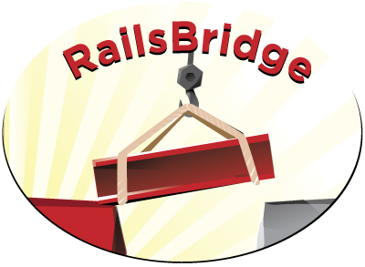

<!SLIDE title-slide center>
#  #
# Bienvenido al Taller Rails
en Español!

<!SLIDE bullets incremental transition=fade>
.notes Que es un Taller Open Source? 

# Taller Código Libre (Open Source) #

* Es un proyecto de la Comunidad!
* Muchos individuos
* Rails Bridge, Dev Chix

<!SLIDE bullets incremental transition=fade>
	
# Materiales accesibles y grátis #
* DevChix wiki, RailsBridge wiki
* Slides: github, slidedown, showoff
* Ver github.com/railsbridge
* Tío Google

<!SLIDE bullets>

# Porqué estamos aquí?
* Ruby on Rails!

<!SLIDE bullets incremental transition=fade>
# Qué es Ruby on Rails?

!SLIDE image center

<!SLIDE subsection>
# Lenguaje
# 

<!SLIDE bullets incremental transition=fade>
## Ruby: Lenguaje de Programación

* Orientado a Objetos
* Propósito General
* Lenguaje natural

!SLIDE
# Framework
# 

<!SLIDE bullets incremental transition=fade>
## Rails: Framework

* Base de Datos agnostico
* Escrito en Ruby

<!SLIDE bullets incremental transition=fade>
# Historia
  * 37signals
  * 2004 - primer release como open source
  * 2007 - Mac OS 10.5 "Leopard" lo incluye in su instalacion 

<!SLIDE bullets incremental transition=fade>
# La Filosofía de Rails

* De opinión fuerte
* Convenciones sobre configuración
* DRY (Don't Repeat Yourself). No te repitas => menos codigo significa, fácil de mantener y modificar. 
* Test Driven Development (TDD). Desarrollo basado en Pruebas
* Pruebas primero, implementación después
* Mínimo código, máximo effecto

<!SLIDE image center transition=fade>

 Basado en el Patron MVC Modelo Vista Controlador 

<!SLIDE image center>

!SLIDE bullets incremental transition=fade
# Prácticas Agiles
* Programación en Pares (XP).
* Programación basada en Pruebas.
* Programación basada en Comportamiento.

<!SLIDE bullets transition=fade>
## Gol:
### &nbsp;
### Al final del día, habrás desarrollado una aplicación web que vivirá en la internet!. 
<!SLIDE bullets transition=fade>
# No seas tímido!

* Pregunta!

<!SLIDE bullets transition=fade>
# Herramientas que utilizaremos 
* **rails**
* **cucumber**: BDD Herramienta para realizar las pruebas
* **rake**: parecido al make para ruby. Una mánera fácil de ejecutar tasks.
* **git**: source code control.
* **database**: Usaremos SQLite, pero recuerda que puedes usar cualquier base de datos relacional.
* **editor**: KomodoEdit.
* **heroku**: grátis host para Rails.

<!SLIDE bullets>
## Materiales
* slides: http://railsbridge.github.com/workshop
* http://wiki.devchix.com/index.php?title=Rails_3_Curriculum

<!SLIDE bullets transition=fade>
## El Proyecto de Hoy

TODO poner el grafico

<!SLIDE bullets transition=fade>
# Agenda
* 9:00-9:30 Registro, cafe
* 9:30-10:00 Introduction
* 10:00-10:50 Session 1
* 11:00-12:00 Session 2
* 12:00-1:00 Almuerzo
* 1:00-2:15 Session 3
* 2:30-3:30 Session 4
* 3:30-4:00 Conclusion y preguntas
* 5:00- 

