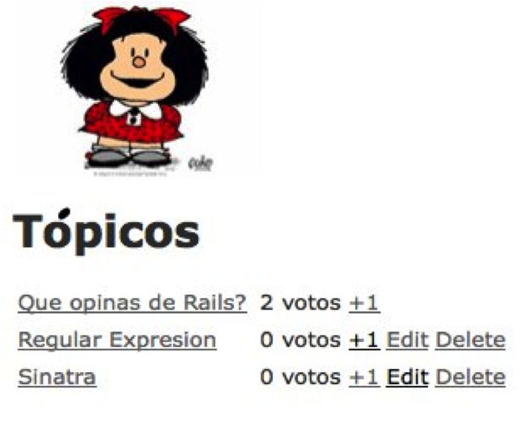

!SLIDE subsection
# Crear una Aplicación RoR Web

!SLIDE bullets incremental transition=fade
# Nuestra aplicacion web va a:
* Crear, editar y/o eliminar tópicos
* Tener la habilidad de votar los tópicos.
<!SLIDE title-slide center>

!SLIDE bullets incremental transition=fade
#Tambien vamos a explorar otros conceptos!
* Desarrollo basado en pruebas (TDD - Test Driven Development)
* Git
* Heroku

!SLIDE subsection
# Empecemos!
!SLIDE bullets incremental transition=fade

# 1) Creamos nuestra aplicación RoR:

    @@@ ruby
    curl -O https://gist.github.com/955119.txt
    $ rails new mafalda -Tm 955119.txt

