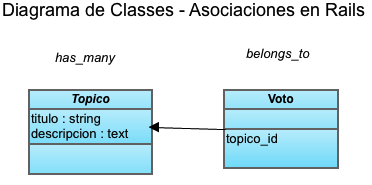

!SLIDE subsection
# Votar en tópicos

!SLIDE  bullets incremental transition=fade
# Votos
* Cada voto sera un objecto (tendra una fila en la base de datos)
* Cuando alguien vote en un tópico, crearemos un nuevo objeto "voto" y lo guardaremos
* Cada voto es asociado con un específico tópico.

!SLIDE subsection
# Asociaciones en Rails

!SLIDE  title-slide center  bullets incremental

# Topico has_many :votos
# Voto belongs_to :topicos

!SLIDE subsection
# Asociaciones en Rails

